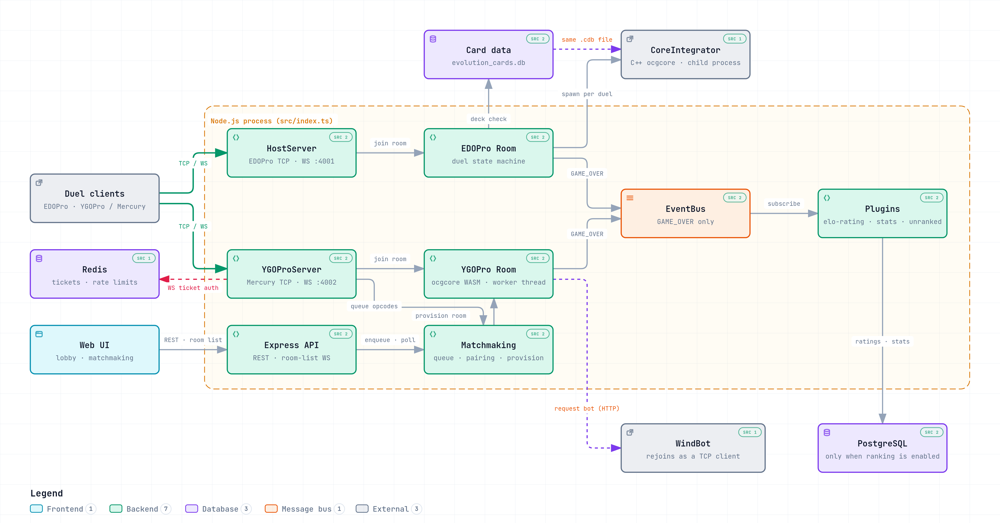

# Architecture — Evolution Server

How the server is put together: one Node process, two independent game engines,
a shared room/event backbone, and two very different duel cores. This is the
map you read before touching anything; the feature documents
(`join-commands.md`, `room-reentry.md`, `plugins.md`) are the zoomed-in views.

Installation, environment variables and the resource pipeline live in the
[README](../README.md) and are not repeated here.

Evidence references point at the current source; update them if files move.

---

## 1. The shape of the system

Everything runs in **a single Node process** (`src/index.ts`). Two game engines
live side by side in it, each speaking its own client protocol, each with its
own room list and card pool — and, crucially, each running the duel rules
engine by a **different mechanism** (§6).

<picture>
  <source media="(prefers-color-scheme: dark)" srcset="./architecture/server-architecture.dark.png">
  
</picture>

Interactive version: [architecture/server-architecture.html](./architecture/server-architecture.html).

Six listeners open on boot (`src/config/index.ts`, logged at the end of `start()`):

| Listener | Purpose | Env var | Default |
|----------|---------|---------|---------|
| EDOPro TCP | EDOPro desktop clients | `HOST_PORT` | — |
| EDOPro WS | EDOPro over WebSocket | `WEBSOCKET_DUEL_PORT` | `4001` |
| YGOPro TCP | Koishi / YGO Mobile / WindBot | `YGOPRO_PORT` | — |
| YGOPro WS | YGOPro over WebSocket | `YGOPRO_WEBSOCKET_PORT` | `4002` |
| HTTP (Express) | REST API | `HTTP_PORT` | — |
| Room-list WS | Lobby broadcast, read-only | `WEBSOCKET_PORT` | — |

The YGOPro engine is called **Mercury** throughout the code: config key
`servers.mercury`, loggers `MercuryRoom` / `MercuryWaitingState`, the import
alias `YGOProRoomList as MercuryRoomList`. Grepping for only one of the two
names finds half the engine.

---

## 2. Boot order

`src/index.ts` is the only composition root. The order is load-bearing, not
incidental:

1. **Object construction** — Express `Server`, EDOPro `HostServer` /
   `WSHostServer`, the Redis ticket repository. Constructors build objects
   only; nothing listens yet.
2. **`bootstrapResources`** — ban lists, **EDOPro first, then YGOPro**
   (`src/bootstrap/bootstrapResources.ts`). YGOPro rooms resolve their EDOPro
   ban-list hash *by name* out of the EDOPro repository, so the reverse order
   silently yields unresolved hashes. The same ordering is repeated by the
   periodic reloader (`bootstrapBanListReloader.ts`).
3. **`bootstrapPersistence`** — SQLite card datasource and its hot reload
   always; **PostgreSQL only when `config.ranking.enabled`**; Redis.
4. **Plugins** — `bootstrapPlugins(eventBus, ...)` **before any socket opens**,
   because a socket that opens first could publish `GAME_OVER` to a bus with no
   subscribers.
5. **WindBot** — `bootstrapWindbot` before any listener, so a malformed botlist
   aborts the boot instead of failing mid-duel.
6. **Matchmaking** — `bootstrapMatchmaking` returns a
   `MatchmakingConnectionFactory` injected into the two YGOPro servers only.
   The EDOPro servers never receive it.
7. **Listen** — HTTP, room-list WS, EDOPro TCP/WS, YGOPro TCP/WS.

Two things to know about failure during this sequence: `start()` is invoked
fire-and-forget, and `src/shared/error-handler/error-handler.ts` installs an
`uncaughtException` handler that logs and swallows. A failure after the first
`await` therefore leaves a **half-initialized process still listening on the
ports opened so far**, rather than exiting.

Configuration is a single object literal built from `process.env` at import
time (`src/config/index.ts`). `.env` is loaded by the runner (`dotenv/config`
in dev, `--env-file` in start), never by application code.

---

## 3. Transport and message dispatch

### 3.1 The socket port

`src/shared/socket/domain/ISocket.ts` is the one transport abstraction:
`send` / `onMessage` / `onClose` / `close` / `destroy`, plus the mutable tags
the rest of the system stamps on a connection (`id`, `roomId`,
`resolvedUserId`, `internalForRoomId`, `watchForRoomId`). Two adapters
implement it — `TCPClientSocket` and `WebSocketClientSocket`.

Four listeners collapse into **two connection handlers**:

| Listener | Handler | Engine |
|----------|---------|--------|
| `HostServer` (TCP), `WSHostServer` (WS) | `SocketConnectionHandler` | EDOPro |
| `YGOProServer` (TCP), `WSYGOProServer` (WS) | `YGOProConnectionHandler` | YGOPro |

Only the **YGOPro WebSocket** listener authenticates its handshake
(`HandshakeTicketAuthenticator`: `Authorization: Bearer`, falling back to a
`?ticket=` query parameter because browsers cannot set WebSocket headers). It
also runs a ping/pong heartbeat that terminates half-open sockets. The EDOPro
WebSocket listener has neither.

### 3.2 Framing

`src/shared/messages/MessageProcessor.ts` accumulates bytes and parses
`[uint16LE size][uint8 command][payload]`. It retains `previousMessage`, which
is how a `CREATE_GAME` handler reads the `PLAYER_INFO` frame that arrived
immediately before it — the two frames are a logical pair on the wire.

### 3.3 Dispatch is an EventEmitter keyed by opcode

There is no middleware stack and no handler registry on the connection path.
The numeric opcode (`src/shared/messages/Commands.ts`) is cast to a string and
emitted on a plain Node `EventEmitter`. Two pumps sit on the same socket:

- **Connection level** (`MessageEmitter`) re-emits a **whitelist** only:
  `PLAYER_INFO`, `CREATE_GAME`, `JOIN_GAME`, `RECONNECT`, and the three
  matchmaking opcodes. Handlers for `CREATE_GAME` / `JOIN_GAME` are constructed
  lazily, the first time that opcode arrives.
- **Room level** (`RoomMessageEmitter` on EDOPro, `SimpleRoomMessageEmitter` on
  YGOPro) forwards **every** frame to `room.emitRoomEvent(...)`, which is why
  room-state listeners have the `(message, room, client)` signature.

Two facts about that emitter drive most of the surprising behaviour in the
codebase:

- **The room's emitter is the host connection's emitter.** It is threaded from
  `SocketConnectionHandler` through `GameCreatorHandler` into `Room`. Every
  in-room command, from every player and every spectator, converges on the
  socket `EventEmitter` of whoever created the room.
- **Every phase transition calls `removeAllListeners()` on it**
  (`RoomState.removeAllListener`, invoked by `waiting()`, `rps()`,
  `choosingOrder()`, `dueling()`, `sideDecking()`). Because that emitter is
  shared with the host's connection, a transition also detaches the host's
  join, create and reconnect handlers. Anything registered there must be
  re-registered after a phase change.

---

## 4. The EDOPro path

`src/edopro/*`. A duel, end to end:

1. **Connect** → `SocketConnectionHandler` assigns a uuid socket id, creates the
   per-connection `EventEmitter` and a child logger. `PING` is answered inline
   and never reaches the emitter.
2. **Create** → `GameCreatorHandler` parses the `PLAYER_INFO` + `CREATE_GAME`
   pair, authenticates when the room carries a password and ranking is enabled,
   builds the `Room`, seats the host and registers it in `RoomList`. A room is
   **ranked** when it has a password *and* ranking is enabled.
3. **Join** → `JoinHandler` applies a per-IP+room wrong-password rate limit in
   Redis, checks the password, then emits `JOIN` into the room. What a join
   *means* is decided by the room's current state, not by the handler.
4. **Deck** → `UPDATE_DECK` builds the deck through `DeckCreator` (card codes
   resolved against SQLite) and validates it with the chain in
   `src/shared/deck/domain/Deck.ts`. A failure sends `DECK_ERROR` and forces the
   player back to *not ready*.
5. **Start** → `TRY_START` requires all players ready, issues one reconnection
   token per player, creates the `Match` and moves to rock-paper-scissors.
6. **RPS → turn order** → the winner picks who plays first, then
   `room.dueling()`.
7. **Duel** → `DuelingState` spawns the core (§6.1), forwards client `RESPONSE`
   frames to it and translates core output back to clients, bounded at 1000
   messages per tick with a `setImmediate` continuation so a huge combo cannot
   starve the event loop.
8. **Game over** → `FinishDuelHandler` records the winner, serializes and
   **sends the replay to the clients** (LZMA-compressed; it is never written to
   disk), then either moves to side-decking for the next duel of the match, or —
   when the match is over — runs the lifecycle hooks, deletes the room and
   publishes `GAME_OVER`.

A client that disconnects mid-duel while at least one opponent is still
connected does **not** tear the room down: the seat is held open for
reconnection (`docs/room-reentry.md`).

---

## 5. The YGOPro (Mercury) path

`src/ygopro/*`. Same skeleton, three structural differences.

**Rooms are created by joining.** `CREATE_GAME` on this path is nearly
vestigial — its handler only logs. The room is created inside the join flow
(`findOrCreateRoom`), driven by a strategy chain
(`JoinStrategyRegistry`, composed at boot):

```
AIJoinToken → WindBot → Watch → Ticket → Default
```

First match wins, and the order encodes real constraints: `Watch` must precede
`Ticket`, or a ticketed socket sending `w,<id>` mints a junk room literally
named `w,<id>`. Command parsing and rule tokens are documented in
[join-commands.md](./join-commands.md).

**There are two doors into a room.** A normal `JOIN` frame goes through version
check and admission; matchmaking instead emits `MATCH_ADMIT` server-side, with
no version check, because a matchmade client never sends a join frame at all.

**Matchmaking is a separate front door** (`src/ygopro/matchmaking/*`), reachable
two ways that feed one pool: in-band CTOS opcodes over the socket
(`MATCHMAKING_AUTH` / `ENTER` / `CANCEL`, ticket-authenticated), and HTTP
polling (`POST /api/matchmaking/queue` + `GET /api/matchmaking/status`). The
pool pairs on a timer; `ProvisionMatchRoom` then builds a room with **no client
wire bytes at all**, reserves the seats for the paired user ids, notifies every
participant *before* anyone is admitted, and seats socket participants
server-side. Details belong in a future `matchmaking.md`; at this level, what
matters is that it produces an ordinary `YGOProRoom` that the rest of the
engine cannot distinguish from a hand-created one.

**WindBot joins by dialling in.** The server never pushes a bot into a room. It
mints a one-shot token bound to `(roomId, botName, deck)`, calls the WindBot
HTTP endpoint with `password=AIJOIN#<token>`, and the bot then connects to the
YGOPro **TCP port as an ordinary client**. `AIJoinTokenStrategy` — first in the
chain — consumes the token, resolves the room by id and marks the client
internal so it skips deck validation.

---

## 6. The two duel cores

This is the single biggest asymmetry in the system, and the one most likely to
mislead: the engines do not share a duel core, nor even a mechanism for running
one.

| | EDOPro | YGOPro (Mercury) |
|---|---|---|
| Mechanism | **Child OS process** (`./core/CoreIntegrator`) | **Worker thread** (`yuzuthread`) running WASM |
| Unit | One process **per duel** — a Bo3 spawns three | One worker per duel |
| Rules engine | `libocgcore.so` (C++, pinned in `core/libocgcore.version`) | `koishipro-core.js` WASM, overridable by the Evolution fork |
| Input | JSON in `argv[1]` at spawn | Worker method calls |
| Server → core | Newline-delimited JSON on stdin, with backpressure handling | Typed worker calls |
| Core → server | `[uint32LE size][JSON]` on stdout | Worker results |
| Message dispatch | `if`-chain on `message.type` | `GameMessageMiddleware`, priority-ordered handlers |
| Timeout | None on the core itself | 60 s per `process()` call |
| On failure | **Silent** — see below | Broadcasts a draw, disposes the worker, sends a synthetic win message |

### 6.1 The EDOPro core process

The launch payload travels in `argv[1]`, and
`serialize-core-launch-payload.ts` exists for one reason: the four 64-bit
shuffle seeds are spliced in as raw integer literals, because
`JSON.stringify` on a `Number` silently rounds anything above 2^53 and would
corrupt every shuffle.

Two operational consequences worth knowing before you debug a stuck room:

- **A core crash is silent.** `exit`, `close` and `error` only log. There is no
  teardown, no chat notice, no `FinishDuelHandler`. The room stays in `DUELING`
  with a dead child, and recovery depends on a player surrendering or on the
  timeout timer — which itself only ever starts if the core sent a `TIME`
  message first.
- **No child process is ever killed.** Teardown is cooperative: the server
  writes `DESTROY_DUEL` to stdin. A core that stops reading stdin is orphaned.

The binary path is relative (`./core/CoreIntegrator`, with `cwd:
process.cwd()`), so the server must be started from the repository root.

---

## 7. The shared backbone

`src/shared/*` is the largest directory in the repository. What genuinely
belongs to both engines:

- **`YgoRoom`** — the base class both room types extend. Owns the mutex, the
  player and spectator lists, `matchId` / `duelIds`, the duel state, and the
  event fan-out.
- **Admission and credentials** — `RoomLeague`, `RoomAdmission`,
  `PlayerCredential`, `Seat`. Shared policy; each engine supplies its own
  credential resolver and admission adapter.
- **Reconnection** — `ExpressReconnectHandler`, `ReconnectionTokenIssuer`,
  `TokenIndex`. Documented in [room-reentry.md](./room-reentry.md).
- **Framing and opcodes**, sockets, logger, event bus, DI, ticket store, rate
  limiting, user auth/profile, ranks and stats, the deck domain and its
  validator chain, the plugin contract.

**Cross-engine aggregators** are the places that know about both room lists at
once, and therefore the places a third engine would cost the most:
`RoomFinder`, `DisconnectHandler`, `GetRoomListController`, the room-list
WebSocket broadcaster, and the loaded-ban-list-names provider.

**Dependency injection is nominal.** The `diod` container holds exactly two
singletons — `EventBus` and `MatchLifecycleHooks`. Everything else is either
constructed at the call site or reached through a hand-rolled static singleton
(`YGOProRoomList`, `RoomList`, `WindbotModule`, `MatchmakingQueue`,
`JoinStrategyRegistry`, `DuelEventPluginHub`, `TokenIndex`, `Redis`,
`WebSocketSingleton`, `LoggerFactory`). Those are global mutable state at
runtime, with `resetForTests` hatches for the suite.

---

## 8. The three event surfaces

They are not interchangeable, and picking the wrong one is a real bug.

| Surface | Timing | Carries | Use it for |
|---------|--------|---------|------------|
| `EventBus` | async, `Promise.allSettled`, unordered | **`GAME_OVER` only** | Persistence and anything that may be slow |
| `DuelEventDispatcher` | **synchronous, ordered** | `duel.damage`, `duel.recover`, `duel.lp-cost`, `duel.turn-start` | In-duel state that must land before the next core message |
| `MatchLifecycleHooks` | `started` non-blocking, `ending` awaited with a 1.5 s budget, `closed` always | match context | Work that must run around teardown |

`GameOverDomainEvent` is the **only** domain event on the bus. Both engines
publish it with the same shape (EDOPro from `FinishDuelHandler`; YGOPro from
`YGOProDuelingState` and from `EndMatchByAbandon`). That is the point where
engine specificity disappears.

The duel dispatcher is deliberately *not* the bus: routing LP and turn
mutations through microtasks would let a later core message read stale state.
The YGOPro room state explicitly no-ops the base subscriber registration,
because on that pipeline the mutations already happen inside the ocgcore
middleware and would otherwise be applied twice.

**Plugins are the only supported extension point.** They are discovered from
the direct children of `src/plugins`, each isolated by its own try/catch so one
broken plugin cannot block boot. They reach the three surfaces through
different channels — `bus.subscribe` for `GAME_OVER`, a scoped subscription
object for duel events (subscribing to an undeclared kind throws), and a
declarative `lifecycleHooks` entry. Duel events additionally pass through
`DuelEventPluginHub`, which bounds each plugin's queue and **disconnects a slow
or overflowing plugin from that room** rather than letting it stall the duel.
See [plugins.md](./plugins.md).

---

## 9. State and persistence

**Almost everything is in memory.** Rooms, matches, ban lists, reconnection
tokens, card pools and the room lists are module-level singletons. A restart
loses every duel in flight; there is no persistence or replay of live state.

**Persistence is gated on ranking.** With `RANK_ENABLED` unset or false, the
PostgreSQL connection is never opened *and* all the ranking plugins refuse to
register — so a `GAME_OVER` results in zero writes. This is the single switch
that most changes the runtime behaviour of the server.

| Store | Holds | Required |
|-------|-------|----------|
| PostgreSQL | user profiles, ranks, ratings, player stats, match resumes | only when ranking is enabled |
| Redis / Valkey | single-use tickets, rate-limit counters, ban-list name backup | optional (`USE_REDIS`) |
| SQLite | card data, read-only | always |

The card layer is worth calling out because it is *two* mechanisms: the EDOPro
engine reads a consolidated `evolution_cards.db` through TypeORM, hot-swapped in
place so the C++ core (which opens a fixed path) sees new cards; the YGOPro
engine does not read SQLite during gameplay at all, serving from in-memory card
pools built from `.cdb` files at boot. Consumers of the SQLite datasource must
call the getter per query and never capture it, or the hot swap is invisible to
them.

Two distinct single-use tickets share the same Redis keyspace: the WebSocket
handshake ticket and the matchmaking ticket. They are semantically different
and indistinguishable at the store, so a ticket consumed by one flow is gone
for the other — a matchmaking enqueue over HTTP consumes its ticket, and the
follow-up WebSocket handshake needs a fresh one.

---

## 10. HTTP and the room-list WebSocket

The Express API (`src/http-server/*`) serves the room list (**merging both
engines**), matchmaking enqueue/status/cancel, ban lists and card lookups, a
resource-version endpoint, and one admin message route behind an auth
middleware. `POST /api/room` creates an **EDOPro room only** — the surface is
asymmetric across engines.

There is **no health or readiness endpoint** and no metrics endpoint. There is
also no inbound bot endpoint: bots are requested outbound (§5).

The room-list WebSocket (`WebSocketSingleton`) is a separate, read-only
broadcast channel. On connect it dumps both engines' room lists, then pushes
`ADD-ROOM` / `UPDATE-ROOM` / `REMOVE-ROOM` as rooms change.

---

## 11. Invariants

Break one of these and the failure is usually silent and far from the change.

1. **Ban lists load EDOPro before YGOPro**, at boot and on every hot reload.
2. **Plugins register before any listener opens**, or early matches publish
   `GAME_OVER` into a bus with no subscribers.
3. **The room emitter is the host's connection emitter, and every phase
   transition clears all its listeners.** Re-register after a transition.
4. **Duel events must stay synchronous.** Async delivery lets later core
   messages read stale LP and turn state.
5. **`FinalizeYGOProRoom` is a single terminal transition**, latched against
   re-entry, and its steps are order-dependent. Lifecycle hooks run *before*
   it, because they read match state it releases.
6. **`GAME_OVER` is published after the room is deleted from the room list.**
   Subscribers cannot look the room up; everything they need must already be in
   the payload.
7. **The shuffle seeds must never round-trip through `Number`.**
8. **The card datasource is read per query, never captured.**
9. **Matchmaking bot rooms stay best-of-1**, because WindBot never submits a
   side deck and a match room would stall in side-decking until timeout.
10. **A WindBot deck override must clear `deckcode`**, or the bot plays its
    original deck and then fails the room's deck check.
11. **Cleanup runs only on socket `close`**, never on `end` or `error` — wiring
    those in previously ran teardown multiple times with stale state.

---

## 12. Known seams

Documented so nobody rediscovers them the hard way. These are observations
about the current shape, not a work plan.

- **The YGOPro engine depends on the EDOPro engine.** `YGOProRoom` imports
  EDOPro's ban-list repository, `PlayerInfoMessage` and `RoomState`;
  `YGOProRoomState` extends EDOPro's `RoomState`; the YGOPro connection handler
  imports EDOPro's `MessageEmitter`. In practice `src/edopro` is a second,
  undeclared shared layer.
- **Shared code that knows about engines.** `YgoRoom` imports both engines'
  client classes, and several `src/shared` files are in fact EDOPro-only or
  YGOPro-only.
- **Two live message pumps on one socket.** Once a YGOPro client exists, its own
  pump is added alongside the connection-level one, and each inbound frame is
  parsed by two independent processors.
- **Room id collision protection is asymmetric.** YGOPro room creation draws
  from `generateUnusedRoomId`, which retries until the id is free in
  `YGOProRoomList` (100 attempts, then throws). The EDOPro path still calls
  `generateUniqueId` directly, with no check at all. Neither consults the other
  engine's room list, while `JoinHandler` searches both and returns the first
  match — so a cross-engine id collision still routes a joiner to the wrong
  room.
- **Rate limiting fails open while ticket consumption fails closed.** Both are
  deliberate, but a Redis outage therefore has opposite effects on two adjacent
  gates of the same request.
- **The "Mercury" / "YGOPro" naming split** (§1) makes single-name greps
  unreliable.

---

## Where to go next

| Topic | Document |
|-------|----------|
| Install, environment, resources | [README](../README.md) |
| Join command wire format and rule tokens | [join-commands.md](./join-commands.md) |
| Reconnection, spectating, watching | [room-reentry.md](./room-reentry.md) |
| Writing a plugin | [plugins.md](./plugins.md) |
| Test conventions | [testing.md](./testing.md) |
| Concurrent duels vs RAM | [memory-capacity.md](./memory-capacity.md) |
